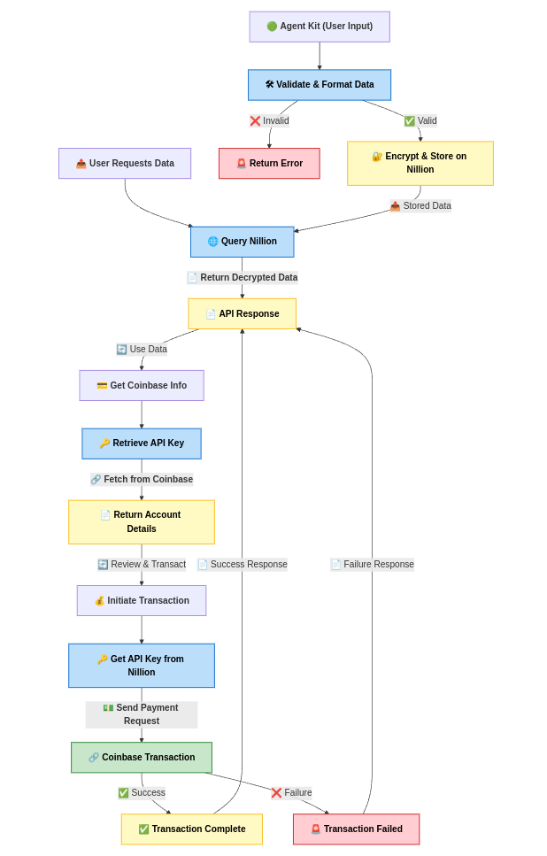

# Nemo - Secure Agent Data Management

## 📌 Overview
**Nemo** is a middleware service designed to securely store, retrieve, and manage agent-related data on **Nillion SecretVault**, while also integrating with **Coinbase Agent Kit** for financial transactions. It ensures a **decentralized, private, and secure** approach to handling sensitive agent information.

### 🎯 Key Features
✅ **Secure Storage:** Store agent-related data in **Nillion's decentralized vault**.  
✅ **Data Retrieval:** Fetch stored agent details using a **schema-based lookup**.  
✅ **Coinbase Integration:** Retrieve **Coinbase account details** and initiate transactions.  
✅ **Error Handling & Validation:** Ensures proper data structure before storing it.  

## 📊 Architecture Flowchart
> _



## 📂 Project Structure
```
Nemo/
├── client/
│   ├── index.js  # Frontend UI (if needed in future)
│   ├── nillionOrgConfig.js  # Configuration for Nillion integration
│   └── schema.json  # JSON Schema defining agent data structure
├── server/
│   └── agentKitIntegration.js  # Core server logic handling API calls
├── package.json  # Dependencies
├── README.md  # Project Documentation
├── LICENSE  # License details
```

## 🏗 **Setup & Installation**

### 🔹 Prerequisites
Ensure you have the following installed:
- **Node.js** (v14 or later)
- **npm** (Node Package Manager)

### 🔹 Installation Steps
```sh
git clone https://github.com/your-repo/nemo.git
cd nemo
npm install
```

### 🔹 Running the Server
```sh
npm start
```
The server will start at **http://localhost:3001**

---

## 📜 **API Endpoints & Usage**

### 📌 **Store Agent Data**
#### **Endpoint:** `/store-agent-data`  
#### **Method:** `POST`
#### **Description:** Stores agent data securely on Nillion.
#### **Request Format:**
```json
{
    "agent_name": { "$share": "John Doe" },
    "api_key": { "$share": "abcd1234" },
    "task_log": ["Completed Task 1", "Pending Task 2"]
}
```
#### **Curl Request:**
```sh
curl -X POST http://localhost:3001/store-agent-data \
-H "Content-Type: application/json" \
-d '{
    "agent_name": { "$share": "John Doe" },
    "api_key": { "$share": "abcd1234" },
    "task_log": ["Completed Task 1", "Pending Task 2"]
}'
```
#### **Response Format:**
```json
{
    "success": true,
    "message": "Agent data stored on Nillion successfully",
    "data": { ... }
}
```

### 📌 **Retrieve Agent Data**
#### **Endpoint:** `/get-agent-data/:schema`
#### **Method:** `GET`
#### **Description:** Fetches stored agent details from Nillion.
#### **Curl Request:**
```sh
curl -X GET http://localhost:3001/get-agent-data/{schema-id}
```
#### **Response Format:**
```json
{
    "success": true,
    "agentData": { ... }
}
```

### 📌 **Retrieve Coinbase Account**
#### **Endpoint:** `/coinbase/account/:schema`
#### **Method:** `GET`
#### **Description:** Retrieves Coinbase account details using the stored API key.
#### **Curl Request:**
```sh
curl -X GET http://localhost:3001/coinbase/account/{schema-id}
```
#### **Response Format:**
```json
{
    "success": true,
    "coinbaseData": { ... }
}
```

### 📌 **Execute Coinbase Transaction**
#### **Endpoint:** `/coinbase/transaction/:schema`
#### **Method:** `POST`
#### **Description:** Initiates a transaction on Coinbase using the stored API key.
#### **Request Format:**
```json
{
    "to": "recipient@example.com",
    "amount": "0.01",
    "currency": "BTC"
}
```
#### **Curl Request:**
```sh
curl -X POST http://localhost:3001/coinbase/transaction/{schema-id} \
-H "Content-Type: application/json" \
-d '{
    "to": "recipient@example.com",
    "amount": "0.01",
    "currency": "BTC"
}'
```
#### **Response Format:**
```json
{
    "success": true,
    "transactionData": { ... }
}
```

---

## 🛠 **Technology Stack**
✅ **Backend:** Node.js + Express  
✅ **Storage:** Nillion SecretVault  
✅ **API Integration:** Coinbase API  
✅ **Security:** UUID-based schema and encrypted API key storage  

---

## 🚀 **Future Enhancements**
- Implement **user authentication** for secure access.
- Support **multi-agent management** with roles.
- Add **frontend UI** for better visualization.

---

## 📝 **License**
This project is licensed under the **MIT License**.

## 🤝 **Contributors**
- **Venkatesh R** (@ni8crawler18), built for Agentic Ethereum 2025


For any queries, raise an issue on **GitHub**.

---

🎉 **Happy Coding with Nemo!** 🚀


